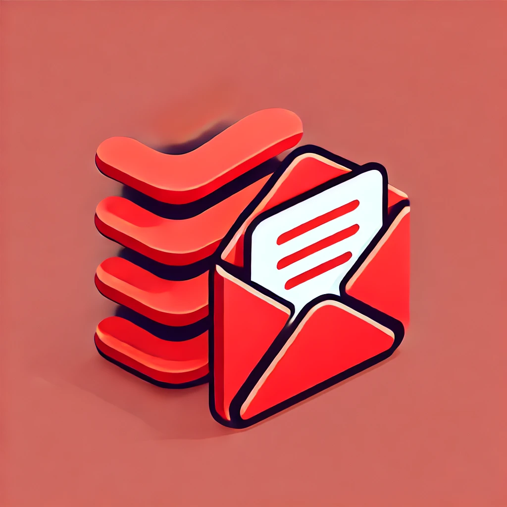

# Contest Alarm

## TLDR
Add your `name`,`email`,`website-list` to subscribers.csv and send merge request to be on an email list.

## 📖 Overview

**Contest Alarm** is a Scala-based application that helps users stay updated with upcoming programming contests. The app fetches contest data from platforms like Codeforces and LeetCode and sends personalized email notifications to users. The system includes:
- A web server for user registration.
- An email service that notifies users of upcoming contests.
- Integration with popular coding platforms for fetching contest data.

## 🛠️ Technologies Used

- **Scala**: Core programming language.
- **Akka HTTP**: For building the web server.
- **Courier**: For sending emails.
- **Docker**: To containerize the application.
- **Render**: For hosting the web server and background worker.